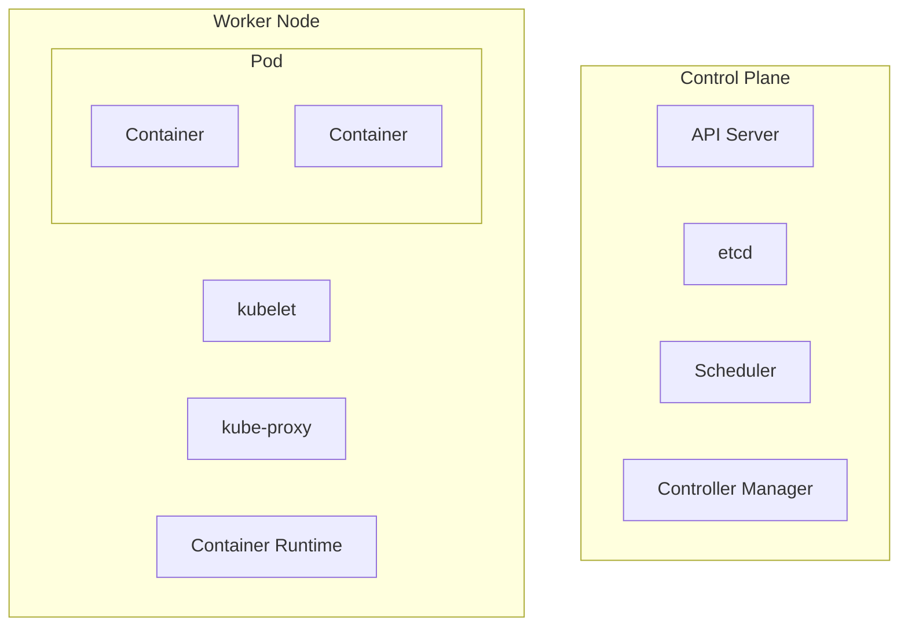

+++
title = "k8s"
heading = "Kubernetes"
+++

Kubernetes (k8s) is an open-source container orchestration platform. It is a
tool that can help manage and deploy containerized applications quickly and
efficiently.

k8s makes is easy to deploy portable infrastructure, and can quickly scale up or
down applications based on demand. k8s also provides functions like
self-healing, automatic rollbacks, horizontal scaling, and service discovery.

k8s comes with the cost of management overhead and contorl plane resource
consumption. Most cloud providers offer managed k8s services, which can help
reduce these costs. AWS EKS, Google GKE, and Azure AKS are some examples of
managed k8s services.

## Kubernetes Architecture

A k8s cluster consists of a control plane and worker nodes. The control plane
manages the cluster and orchestrates the worker nodes, and the worker nodes run
containered applications.

### Kubernetes Control Plane

The k8s control plane is consisted of 4 main components: the controller manager,
the scheduler, the API server, and etcd.

The API server provies a RESTful API for managing the cluster.

etcd is a distributed key-value store that k8s uses to store the state of the
cluster.

The scheduler is responsible for scheduling pods onto worker nodes based on
resource requirements and other constraints.

The controller manager is responsible for running various controllers that
manage the state of the cluster, such as the replication controller, which
ensures that a specified number of pod replicas are running at all times.

### Kubernetes Worker Node

A pod is the smallest deployable unit in k8s, and they can contain one or more
containers. Pods can also have shared storage and network resources that the
containers within the pod can use.

Aside from the application containers, a worker node also contains the container
runtime, kubelet, and kube-proxy.

kubelet is a daemon that runs on each worker node and is responsible for
communicating with the control plane to manage the pods and containers on that
node.

The container runtime is responsible for running and stopping the containers,
pulling images from a container registry, and managing the container lifecycle.

kube-proxy is a network proxy that routes network traffic to the appropriate
pods while also providing load balancing and service discovery for the cluster.
